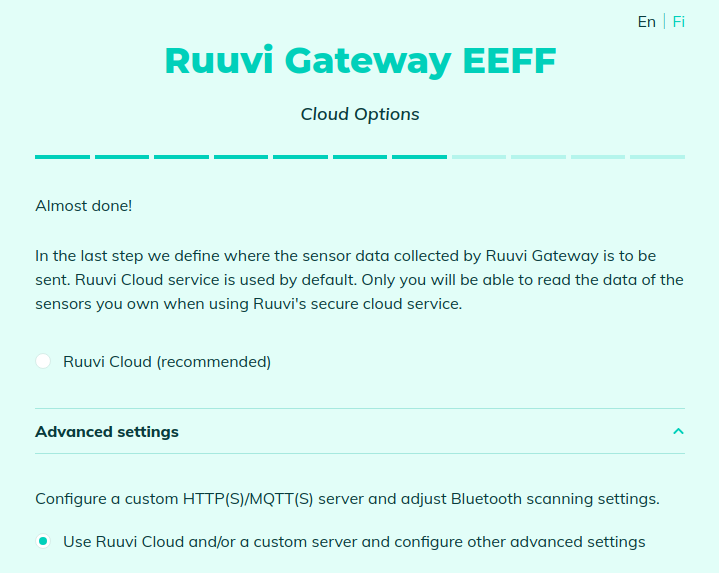
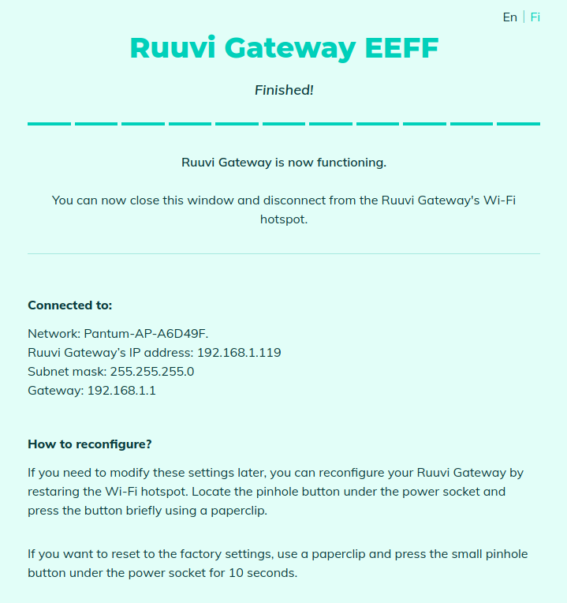
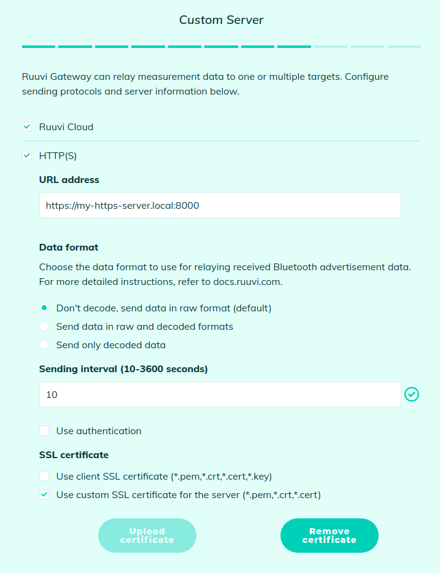

# ruuvi.ruuvi_gwui.html

## Ruuvi Gateway web UI
This repository contains files related to the web interface of the Gateway configurator. 

## Gateway simulator

For the UI testing, a Gateway simulator can be used.

### Pre-requisites:
* python 3.8

To start simulator run: 

`python ./ruuvi_gw_http_server.py`

To test UI, open in web-browser: http://127.0.0.1:8001

You can choose any WiFi from the list, the valid password is `12345678`

======================================

## Testing HTTP-requests from the Gateway

To test connection from the Gateway to HTTP-server you need to run an HTTP-server on your PC.

You can use `http_server_auth.py` script to run HTTP-server. 

### Pre-requisites:
* python 3.8

To test connection from the Gateway to HTTP-server, use `http_server_auth.py`

To run HTTP-server without auth:

`python http_server_auth.py --bind <IP>`

To run HTTP-server with auth:

`python http_server_auth.py --bind <IP> -u <username> -p <password>`

To run HTTPS-server with auth:

`python http_server_auth.py --bind <IP> --ssl_cert=./server.pem -u <username> -p <password>`

To generate certificate for HTTPS (`server.pem`):

`openssl req -new -x509 -keyout server.pem -out server.pem -days 365 -nodes`

## Example of testing a gateway configured to transfer data via HTTP

* Connect your computer to a WiFi network 
  and find out what IP address has been assigned to your computer 
  (we will refer to it as `<IP>` in the following).
  
* Reset the Gateway configuration by pressing the CONFIGURE button for 5 seconds
  
* Connect your PC to the Gateway's WiFi access point, 
  the Gateway configuration page will be automatically opened in your web-browser
  
* On the "SERVER SETTINGS" page select "Use Custom Server" option: 
  
  
  
* On the next page set URL to `http://<IP>:8000/record`, leave the 'User' and 'Pass' fields blank:
  
  
  
* On the next page select which devices to scan
  
* On the next page (`INTERNET CONNECTION`) select WiFi
  
* On the next page choose WiFi-network and connect to it, after the connection will be established you should see the following page:
  
  
  
* Close the Configuration UI in browser
  
* Connect your PC to the same WiFi-network as the Gateway is connected
  
* Check that your PC can communicate with the Gateway via WiFi - use `ping <gateway-IP>`
  
* Run HTTP-server on your PC:
  `python http_server_auth.py --port 8000 --bind <IP>`
  
  in this example: `python http_server_auth.py --port 8000 --bind 192.168.1.38`
  
* Wait at least 10 seconds until the Gateway to send the accumulated data

## Example of testing a gateway configured to transfer data via HTTPS

* Connect your computer to a WiFi network
  and find out what IP address has been assigned to your computer
  (we will refer to it as `<IP>` in the following).
  
* Reset the Gateway configuration by pressing the CONFIGURE button for 5 seconds
  
* Connect your PC to the Gateway's WiFi access point,
  the Gateway configuration page will be automatically opened in your web-browser
  
* On the "SERVER SETTINGS" page select "Use Custom Server" option:

  
  
* On the next page set URL to `https://<IP>:8000/record`, 
  fill the 'User' and 'Pass' fields with `user` and `pass` accordingly:

  
* On the next page select which devices to scan
  
* On the next page (`INTERNET CONNECTION`) select WiFi
  
* On the next page choose WiFi-network and connect to it, after the connection will be established you should see the following page:

  
  
* Close the Configuration UI in browser
  
* Connect your PC to the same WiFi-network as the Gateway is connected
  
* Check that your PC can communicate with the Gateway via WiFi - use `ping <gateway-IP>`
  
* Run HTTPS-server on your PC:
  `python http_server_auth.py --port 8000 --bind <IP> --ssl_cert=./server.pem -u user -p pass`
  
  in this example: `python http_server_auth.py --port 8000 --bind 192.168.1.38`
  
* Wait at least 10 seconds until the Gateway to send the accumulated data
