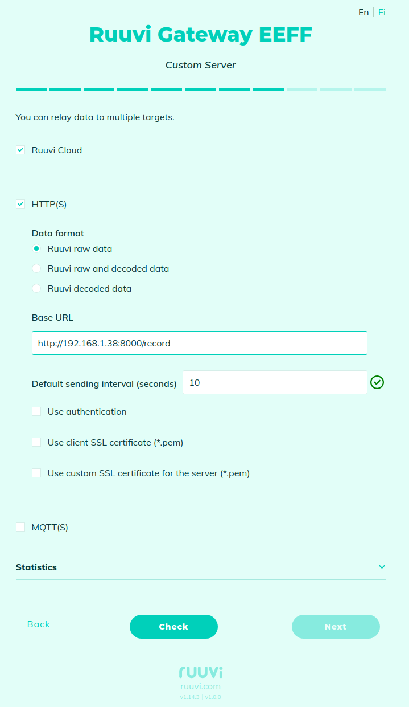

# ruuvi.gwui.html

## Ruuvi Gateway web UI

This repository contains files related to the web interface of the Gateway configurator. 

### Pre-requisites:

* Install npm:

  `sudo apt install npm`

* Install the Node.js modules that ruuvi.gwui.html depends on:

  `npm install`

## Gateway simulator

For the UI testing, a Gateway simulator can be used.

### Pre-requisites:

* python 3.10

### Setup venv

* Create venv:

  `python3 -m venv .venv`
 
* Activate venv:

  `source .venv/bin/activate`
 
* Upgrade pip:

  `pip install --upgrade pip`

* Install dependencies:

  `pip install -r requirements.txt`

### Run simulator

* `source .venv/bin/activate`
* `python3 scripts/ruuvi_gw_http_server.py`

To test UI, open in web-browser: http://127.0.0.1:8001
Use default password to access the UI: `00:11:22:33:44:55:66:77`

On the 'Wi-Fi Networks' page you can simulate connection to Wi-Fi network. 
Choose Wi-Fi 'Pantum-AP-A6D49F' with password `12345678`.

On the 'Custom Server' page use URL 'https://network2.ruuvi.com/record' to simulate connection with a custom HTTP server.
To check authentication use URL 'https://network.ruuvi.com/record1' with username 'user1' and password 'pass1'.

On the 'Software Update' page under 'Advanced settings' you can use one of the following URLs to simulate checking for firmware updates:
'https://network.ruuvi.com/firmwareupdate', 'https://network2.ruuvi.com/firmwareupdate'.

On the 'Automatic Configuration Download' page you can use one of the following URLs to simulate downloading configuration from the remote server:
* 'http://192.168.1.100' - to download without authentication
* 'http://192.168.1.101' - to download with 'basic' authentication, username 'user1' and password 'pass1'
* 'http://192.168.1.102' - to download with 'bearer' authentication, token 'token123'

======================================

## Testing HTTP requests from the Gateway

To test connection from the Gateway to HTTP server you need to run an HTTP server on your PC.

You can use `http_server_auth.py` script to run HTTP server. 

### Pre-requisites:

* python 3.10

To test connection from the Gateway to HTTP server, use `http_server_auth.py`

To run HTTP server without auth:

`python3 scripts/http_server_auth.py --port 8000`

To run HTTP server with auth:

`python3 scripts/http_server_auth.py --port 8000 -u <username> -p <password>`

To run HTTPS server:

`python3 scripts/http_server_auth.py --port 8000 --ssl_cert=./server_cert.pem --ssl_key=./server_key.pem`

To run HTTPS server with the client SSL certificate checking:

`python3 scripts/http_server_auth.py --port 8000 --ssl_cert=./server_cert.pem --ssl_key=./server_key.pem --ca_cert=./client_cert.pem`

To generate a certificate and a private key for HTTPS server (2048-bit RSA key) (`server_cert.pem` and `server_key.pem`):

* Generate a private key :

  `openssl genrsa -out server_key.pem 2048`

* Create a Certificate Signing Request (CSR): Generate a CSR using the private key created in the previous step.
  The CSR contains information about your client that the Certificate Authority (CA) will use to create the client certificate.

  `openssl req -new -key server_key.pem -out server_csr.pem`

* Generate the client certificate: You have two options for generating the client certificate:
  * Option A: Self-signed certificate - You can create a self-signed client certificate using the CSR and the client's private key.
    Note that self-signed certificates might not be trusted by all servers and are generally not recommended for production environments.

    `openssl x509 -req -in server_csr.pem -signkey server_key.pem -out server_cert.pem -days 365`

  * Option B: Certificate signed by a Certificate Authority (CA) - If you need a trusted client certificate,
    you should send the CSR (client_csr.pem) to a Certificate Authority (CA) and request them to sign the certificate.
    The CA will provide you with a signed client certificate (usually in PEM format) upon approval.

To generate a certificate and a private key for the client (2048-bit RSA key) (`client_cert.pem` and `client_key.pem`):

* Generate a private key:
  
  `openssl genrsa -out client_key.pem 2048`

* Create a Certificate Signing Request (CSR): Generate a CSR using the private key created in the previous step. 
  The CSR contains information about your client that the Certificate Authority (CA) will use to create the client certificate.
 
  `openssl req -new -key client_key.pem -out client_csr.pem`

* Generate the client certificate: You have two options for generating the client certificate:
  * Option A: Self-signed certificate - You can create a self-signed client certificate using the CSR and the client's private key. 
    Note that self-signed certificates might not be trusted by all servers and are generally not recommended for production environments.

    `openssl x509 -req -in client_csr.pem -signkey client_key.pem -out client_cert.pem -days 365`

  * Option B: Certificate signed by a Certificate Authority (CA) - If you need a trusted client certificate, 
    you should send the CSR (client_csr.pem) to a Certificate Authority (CA) and request them to sign the certificate. 
    The CA will provide you with a signed client certificate (usually in PEM format) upon approval.

## Example of testing a gateway configured to transfer data via HTTP

* Connect your computer to a Wi-Fi network 
  and find out what IP address has been assigned to your computer 
  (we will refer to it as `<IP>` in the following).
  
* Reset the Gateway configuration by pressing the CONFIGURE button for 5 seconds
  
* Connect your PC to the Gateway's Wi-Fi access point, 
  the Gateway configuration page will be automatically opened in your web-browser
  
* On the "Cloud Options" page under "Advanced settings" select "Use Ruuvi Cloud and/or a custom server and configure other advanced settings" option: 
  
  
  
* On the next page configure custom HTTP and set URL to `http://<IP>:8000/record`:
  
  

* Configure the required options on the following pages and complete the configuration:
  
  
  
* Close the Configuration UI in browser
  
* Connect your PC to the same WiFi-network as the Gateway is connected
  
* Check that your PC can communicate with the Gateway via Wi-Fi - use `ping <gateway-IP>`
  
* Run HTTP server on your PC:
 
  `python3 ./scripts/http_server_auth.py --port 8000`
 
  or if you want to test with authentication:
 
  `python3 ./scripts/http_server_auth.py --port 8000 -u user -p pass`
  
* Wait at least 10 seconds until the Gateway to send the accumulated data

## Example of testing a gateway configured to transfer data via HTTPS

* Connect your computer to a Wi-Fi network
  and find out what IP address has been assigned to your computer
  (we will refer to it as `<IP>` in the following).
  
* Reset the Gateway configuration by pressing the CONFIGURE button for 5 seconds
  
* Connect your PC to the Gateway's Wi-Fi access point,
  the Gateway configuration page will be automatically opened in your web-browser

* On the "Cloud Options" page under "Advanced settings" select "Use Ruuvi Cloud and/or a custom server and configure other advanced settings" option: 

  

* On the next page configure custom HTTP and set URL to `https://<IP>:8000/record`:

  
 
* Configure the required options on the following pages and complete the configuration:

  
  
* Close the Configuration UI in browser
  
* Connect your PC to the same WiFi-network as the Gateway is connected
  
* Check that your PC can communicate with the Gateway via Wi-Fi - use `ping <gateway-IP>`
  
* Run HTTPS server on your PC:
 
  `python3 ./scripts/http_server_auth.py --port 8000 --ssl_cert=./server.pem`
 
  or if you want to test with authentication:
 
  `python3 ./scripts/http_server_auth.py --port 8000 --ssl_cert=./server.pem -u user -p pass`
  
* Wait at least 10 seconds until the Gateway to send the accumulated data
